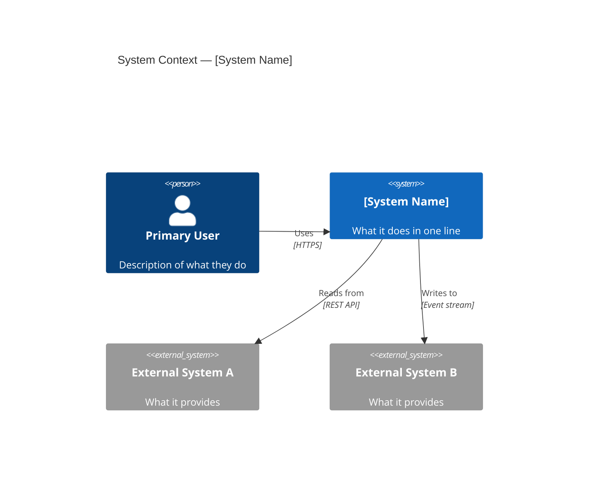
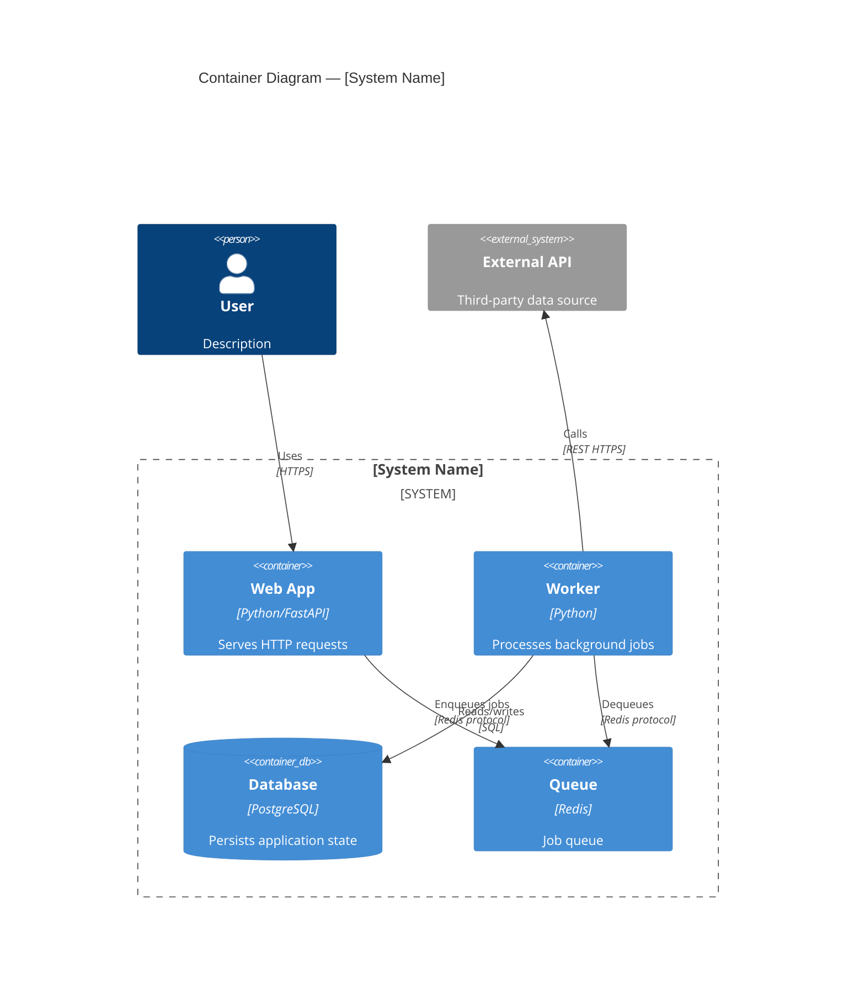
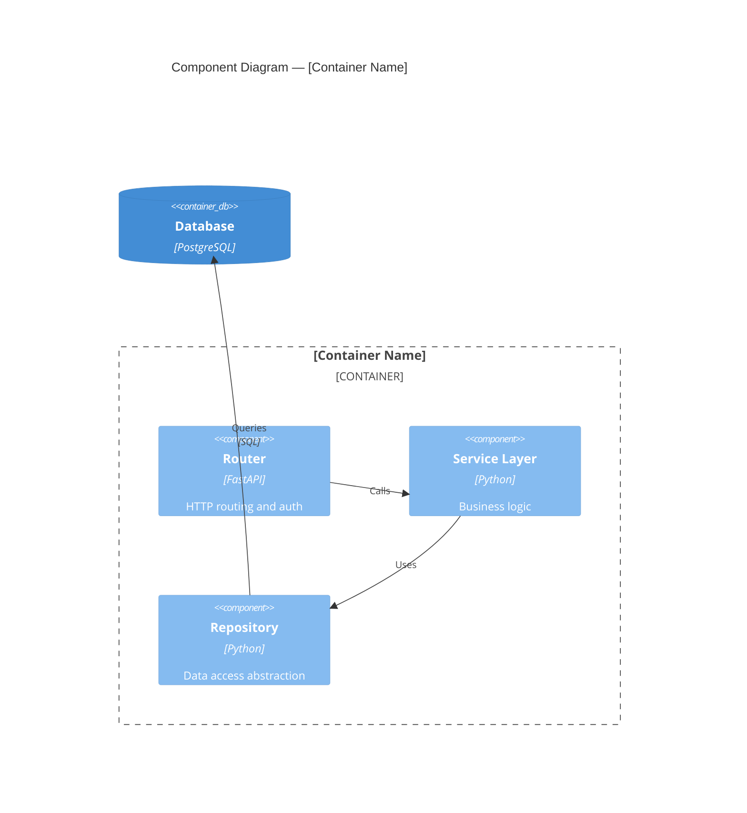
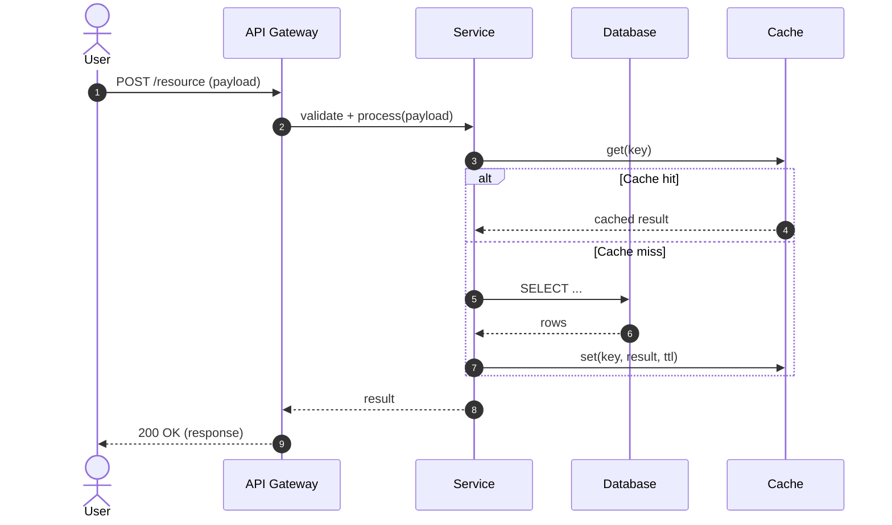
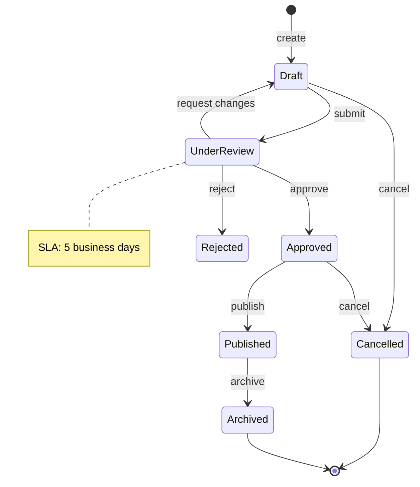
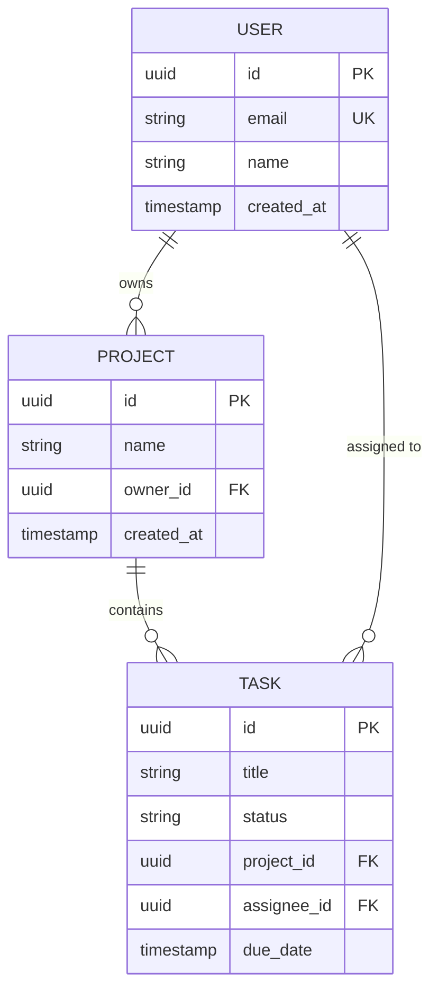
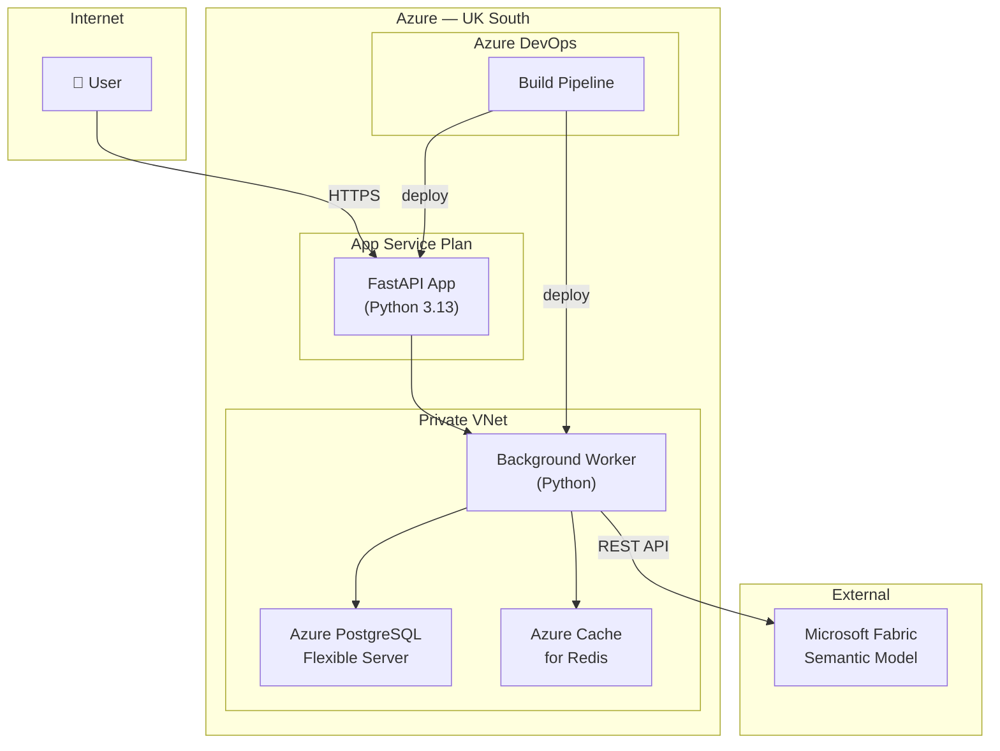
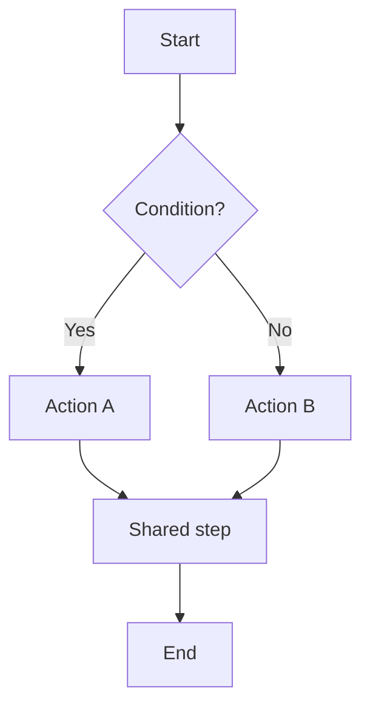

Generate architecture diagrams for: $ARGUMENTS

# Architecture Diagramming — Rigorous Mermaid Output

This command produces the right diagram(s) for the context. Do not default to a sequence
diagram for everything — choose diagram types that reveal structure, not just flow.

---

## Step 1: Identify what you need to show

| Question | Best diagram type |
|----------|------------------|
| Where does this system sit among external actors? | **C4 Context** |
| What are the major containers/services inside the system? | **C4 Container** |
| What are the components inside a single container? | **C4 Component** |
| How do objects/services call each other over time? | **Sequence** |
| What states can an entity move through? | **State** |
| What are the data entities and their relationships? | **Entity-Relationship (ERD)** |
| How does the system deploy — hosts, networks, zones? | **Deployment** |
| What are the task or build dependencies? | **Directed Graph (flowchart)** |
| How does a class hierarchy or interface relate? | **Class** |

Produce **only the diagrams that add information**. If a sequence diagram and a flowchart would
show the same thing, produce the sequence diagram — it shows order, which a flowchart does not.

---

## Diagram Type Reference

### C4 Context Diagram
Shows the system in relation to external users and systems. One diagram per system.

When to include:
- Always for the system-level architecture document
- In feature plan.md when the feature introduces a new external integration

---

### C4 Container Diagram
Shows the major deployable units (applications, databases, queues) inside the system boundary.

When to include:
- In the architecture document when there are multiple deployable units
- In feature plan.md when the feature spans containers

---

### C4 Component Diagram
Shows the internal structure of one container — classes, modules, interfaces.

When to include:
- In feature plan.md when the feature's internal structure needs clarifying
- Only when a container has ≥3 distinct internal components

---

### Sequence Diagram
Shows interactions between actors/services in time order.

Rules for good sequence diagrams:
- Use `autonumber` for every diagram
- Use `alt`/`else`/`opt` to show conditional flows — don't flatten them
- Show both happy path AND error/alternative paths
- Name participants clearly (avoid generic "Service1", "Service2")
- Add a `Note` for important side effects or constraints

---

### State Diagram
Shows how an entity transitions between states in response to events.

When to include:
- When an entity has a lifecycle (orders, approvals, workflows, tasks)
- In feature plan.md when the feature changes how an entity transitions

---

### Entity Relationship Diagram (ERD)
Shows data entities and the relationships between them.

Rules for good ERDs:
- Mark PK, FK, UK explicitly
- Show cardinality (`||--o{`, `||--|{`, `}o--o{`)
- Include only the entities relevant to the feature or system
- Show at least the key non-relational fields (not just IDs)

---

### Deployment Diagram
Shows where components run — hosts, containers, cloud regions, network zones.

When to include:
- In the architecture document when deployment topology is non-trivial
- When security boundaries, network zones, or data residency matter

---

### Flowchart (directed graph)
Shows process flow, decision trees, or task dependencies.

Prefer `flowchart TD` over `graph TD` for process flows — identical syntax, clearer intent.
Use sequence diagrams instead when the flow involves multiple actors interacting over time.

---

## Step 2: Produce the diagrams

For each selected diagram:
1. Confirm the diagram type and what it will show
2. Generate the Mermaid source with realistic, named entities
3. Add a one-sentence caption explaining what the diagram reveals

---

## Step 3: Save and wire in

**For a new feature spec:**
- Add diagrams to `specs/[feature]/plan.md` (Spec Kit's `/speckit-plan` output)

**For the architecture document:**
- Add or update diagrams in `project-management/Background/01-final-architecture-document.md`

**For a standalone analysis:**
- Save to `project-management/Work/analysis/diagrams-[topic].md`

---

## Quality rules

- Every diagram must have a `title` or caption
- Sequence diagrams must use `autonumber`
- ERDs must mark PK/FK/UK
- C4 diagrams must use C4Context/C4Container/C4Component keywords (not plain flowcharts)
- No more than 12–15 nodes per diagram — split into multiple diagrams if larger
- Only include a diagram if it reveals something that prose cannot
