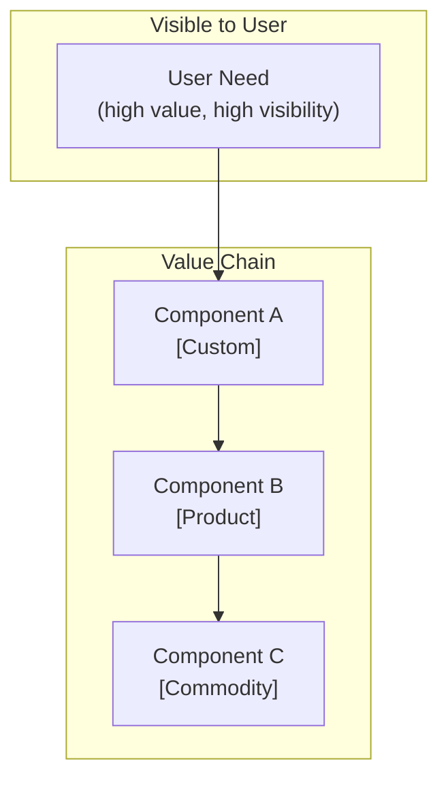

Create a Wardley Map for: $ARGUMENTS

# Wardley Mapping — Strategic Landscape Analysis

Wardley Maps help answer: "What should we build, buy, or outsource?" They reveal the evolutionary
stage of each component and surface where custom build adds unique value vs. where commodity
solutions should be used.

## When to use this command

- During **SEED** — to understand whether a problem is worth solving uniquely or whether existing
  solutions are already commoditised
- During **DESIGN** — to decide which components to build vs. buy before committing to an ADR
- When a technology decision involves a significant build/buy trade-off

---

## Step 1: Identify the value chain

List the **user need** at the top, then trace every component the system needs to deliver that
need.

```
User Need
  └── Component A (what the user directly interacts with)
        └── Component B (what A depends on)
              └── Component C (what B depends on)
                    └── Component D (infrastructure / platform)
```

Ask for each component:
- What does the user directly value?
- What enables that value?
- What does *that* depend on?

Continue until you reach infrastructure or commodity platforms.

---

## Step 2: Assign evolution stages

For each component, assess its evolutionary stage:

| Stage | Characteristics | Typical source |
|-------|----------------|----------------|
| **Genesis** | Novel, unstable, custom; competitive differentiator | Build in-house |
| **Custom** | Best practice emerging; built for specific context | Build or bespoke |
| **Product** | Multiple competing products exist; becoming standard | Buy (COTS/SaaS) |
| **Commodity** | Standardised, utility; invisible infrastructure | Buy or use cloud |

Signals of evolution:
- **Genesis → Custom**: blog posts, papers, first implementations appear
- **Custom → Product**: open-source libraries, vendor products, comparisons written
- **Product → Commodity**: cloud services, APIs, "just use X"

---

## Step 3: Draw the map (Mermaid)



Label each node with its evolution stage in brackets: `[Genesis]`, `[Custom]`, `[Product]`,
`[Commodity]`.

---

## Step 4: Identify strategic insights

Answer each question:

**Build candidates (Genesis/Custom):**
- Which components are in Genesis or Custom that directly deliver your unique user value?
- These are candidates for in-house build — they are your differentiators.

**Buy/outsource candidates (Product/Commodity):**
- Which components are already Product or Commodity?
- Using a vendor here is not a compromise — it is correct strategy.
- Building in this zone is waste.

**Evolution pressure:**
- Which Genesis components are moving toward Custom? Plan for increasing competition.
- Which Custom components are becoming Products? Evaluate switching to vendor solutions.

**Inertia risks:**
- Are you building something in the Product/Commodity zone because of legacy, familiarity, or
  NIH? Name it explicitly.

---

## Step 5: Produce the output

Save as `project-management/Work/analysis/wardley-[topic].md` with:

```markdown
# Wardley Map: [Topic]

## User Need
[One sentence: what does the user value?]

## Value Chain

| Component | Stage | Notes |
|-----------|-------|-------|
| [name] | Genesis / Custom / Product / Commodity | [why this stage] |

## Map

[Mermaid diagram]

## Strategic Insights

### Build (unique value — in-house)
- [Component]: [reason it is a differentiator at this stage]

### Buy / Outsource (commodity zone)
- [Component]: [recommended vendor or platform]

### Evolution Risks
- [Component] is in [stage] now but moving to [next stage] — revisit in [timeframe]

### Inertia Warnings
- [Any identified NIH or legacy biases]

## Recommended ADR

[If this analysis informs an architectural decision, state: "This analysis supports
ADR-NNN: [topic]. Create the ADR before proceeding to DESIGN."]
```

---

## Guidelines

- Be ruthlessly honest about evolution stage — overestimating uniqueness leads to wasted build effort
- A Wardley Map is a hypothesis, not ground truth — update it as you learn
- Components that are Commodity in one context may be Custom in another (context matters)
- The goal is not a perfect map but surfacing the key build/buy decisions before code is written
