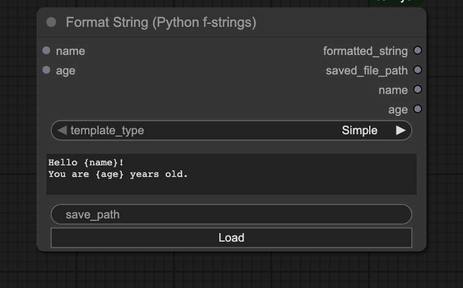
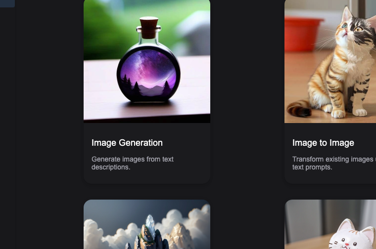
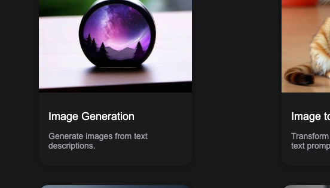
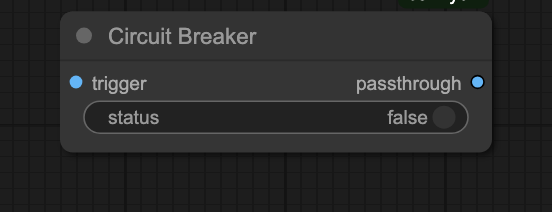
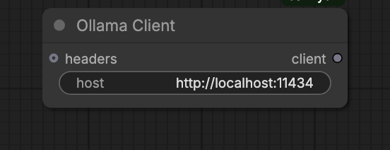
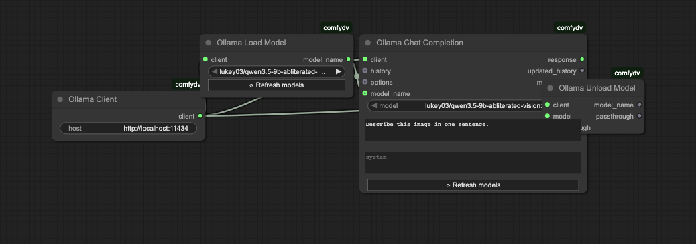
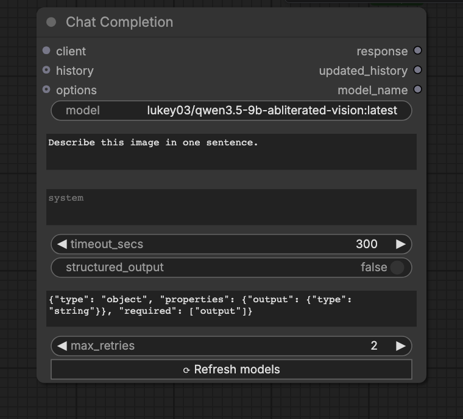
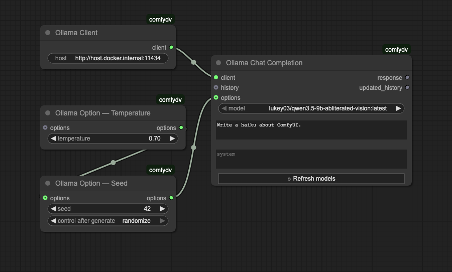
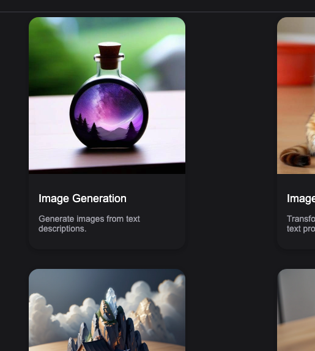

# comfydv

A collection of workflow efficiency and quality-of-life nodes built out of necessity for personal ComfyUI use.

## What is this?

`comfydv` fills gaps in ComfyUI's built-in node library: dynamic string formatting, seed-controlled random selection, graceful workflow interruption, and Ollama LLM integration. Install it once and connect the nodes like any other — no Python knowledge required.

| Node | What it does |
|------|-------------|
| **Format String** | Formats a string from a Python f-string or Jinja2 template. Detects variables in the template and automatically adds/removes input sockets. |
| **Random Choice** | Accepts any number of typed inputs and outputs one at random, with a configurable seed for reproducibility. |
| **Circuit Breaker** | Halts the current ComfyUI queue run gracefully without crashing the server. Wire the `status` toggle to a boolean condition to skip the rest of the queue when a condition isn't met. |
| **Ollama Client** | Configures a connection to an Ollama server (default: `http://localhost:11434`). Threads the host URL through the graph as an `OLLAMA_CLIENT` socket. |
| **Ollama Model Selector** | Fetches the live model list from Ollama and presents it as a dropdown. Outputs the selected model name. |
| **Ollama Load Model** | Loads a model into Ollama's memory using `/api/show` with `keep_alive=-1`. |
| **Ollama Unload Model** | Evicts a model from Ollama's memory using `/api/show` with `keep_alive=0`. |
| **Ollama Chat Completion** | Sends a prompt (and optional conversation history) to Ollama `/api/chat` and returns the response text plus the updated history. |
| **Ollama Option — \*** | Seven composable option nodes (Temperature, Seed, Max Tokens, Top P, Top K, Repeat Penalty, Extra Body) that merge into an `OLLAMA_OPTIONS` dict wired into Chat Completion. |
| **Ollama Debug History** | Serialises an `OLLAMA_HISTORY` list to a pretty-printed JSON string for inspection. |
| **Ollama History Length** | Returns the number of messages in an `OLLAMA_HISTORY` list as an integer. |

## Install

**Via ComfyUI Manager** (recommended): search for `comfydv` and click Install.

**Manual:**

```bash
cd /path/to/ComfyUI/custom_nodes
git clone https://github.com/darth-veitcher/comfydv.git
```

Restart ComfyUI. The nodes appear under the **dv/** and **dv/ollama** categories in the node menu. Runtime dependencies (`jinja2`, `aiohttp`) are installed automatically via `requirements.txt`.

For Ollama nodes: [install Ollama](https://ollama.com/download) and pull at least one model (`ollama pull qwen2.5:latest`) before using the Ollama nodes.

## Quickstart

1. Install via ComfyUI Manager (search `comfydv`) or clone manually into `custom_nodes/`.
2. Right-click the canvas → Add Node → **dv/** to find Format String, Random Choice, and Circuit Breaker.
3. For Ollama nodes: start Ollama (`ollama serve`), pull a model (`ollama pull qwen2.5:latest`), then add nodes from **dv/ollama/**.

## Documentation

Full documentation: [darth-veitcher.github.io/comfydv](https://darth-veitcher.github.io/comfydv/stable/)

---

## Format String

Formats text from a Python f-string or Jinja2 template. As you type the template, input sockets appear and disappear automatically — one per variable detected.

### Python f-strings

Type `{variable_name}` and a socket appears. Wire it to any string output in your workflow.



Outputs are always in a stable order:

| Output | Content |
|--------|---------|
| `formatted_string` | The rendered result |
| `saved_file_path` | Path written to disk (if `save_path` is set) |
| `<var>` … | Pass-through of each input value, for easy chaining |

### Jinja2 templates

Switch `template_type` to **Jinja2** to unlock filters (`| upper`, `| int`, …), conditionals (`…`), and loops.



Variables detected in `{{ }}` expressions become input sockets exactly as in Simple mode. See the [Jinja2 documentation](https://jinja.palletsprojects.com/en/latest/) for the full filter/test reference.

---

## Random Choice

Connect any number of inputs of the same type. Each run picks one at random. Set `seed` for reproducibility.



- Accepts any ComfyUI type (STRING, IMAGE, CONDITIONING, …)
- Add as many inputs as you like; unused slots are removed automatically when disconnected
- `seed = 0` randomises on every run; any other value locks the selection

---

## Circuit Breaker

Stops the queue gracefully when a condition isn't met — no crash, no error, just a clean halt.



Wire an image (or any trigger) into `trigger` and a boolean into `status`. When `status` is **false** the node raises `InterruptProcessingException`, which tells ComfyUI to stop the current run cleanly. When `status` is **true** the image passes through unchanged.

Typical use: skip an expensive upscale step when a quality-check node says the draft is already good enough.

---

## Ollama

14 nodes for integrating a local Ollama LLM into your ComfyUI workflow. The host URL is configured once in **Ollama Client** and threaded through the graph — all downstream nodes receive it via the `OLLAMA_CLIENT` socket.

### Ollama Client node

Configure the server address once; all downstream Ollama nodes inherit it automatically.



### Model lifecycle (load and unload)

On memory-constrained machines and single-GPU setups, explicitly loading and unloading the model before and after inference is critical. **Ollama Load Model** pins the model into VRAM (`keep_alive=-1`); **Ollama Unload Model** evicts it immediately (`keep_alive=0`), freeing memory for image generation or other models.



The correct chain is **Load → Chat → Unload**, enforced through data dependencies:

1. Wire `OllamaLoadModel.model_name` → `OllamaChatCompletion.model_name` (optional input). This guarantees Load runs before Chat and overrides the Chat dropdown with the same model.
2. Wire `OllamaChatCompletion.model_name` → `OllamaUnloadModel.model`. This guarantees Unload runs after Chat.
3. Optionally wire `OllamaChatCompletion.response` → `OllamaUnloadModel.passthrough` — Unload returns the response unchanged so the rest of your workflow can still consume it.

### Minimal chat workflow

1. **Ollama Client** → set host (default `http://localhost:11434`)
2. **Ollama Model Selector** → pick a model from the live dropdown
3. **Ollama Chat Completion** → wire client + model + prompt → response string



Wire multiple nodes together for a complete end-to-end workflow:



### Option nodes

Chain any combination of **Ollama Option —** nodes before Chat Completion to override inference parameters:

| Option node | Ollama param |
|-------------|-------------|
| Temperature | `temperature` |
| Seed | `seed` |
| Max Tokens | `num_predict` |
| Top P | `top_p` |
| Top K | `top_k` |
| Repeat Penalty | `repeat_penalty` |
| Extra Body | arbitrary JSON merged into options |



### Multi-turn conversations

`OLLAMA_HISTORY` flows out of Chat Completion as a list of `{"role", "content"}` dicts. Wire it back into the next Chat Completion for multi-turn conversations, or inspect it with **Ollama Debug History** / **Ollama History Length**.
