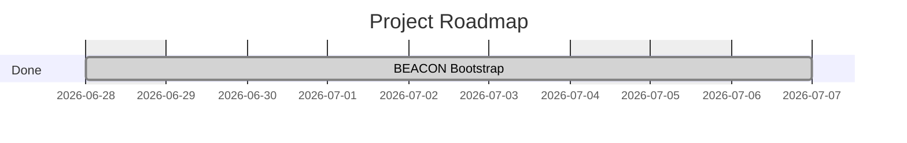

# comfydv — Roadmap

<!-- generated by beacon roadmap export — 2026-06-28 -->

> comfydv is a small, high-quality ComfyUI utility pack that fills the gaps the core node library leaves: composable string formatting, seed-controlled randomisation, and workflow flow-control. Winning looks like: every node is well-tested, installs in one step, produces no surprises in production workflows, and is documented well enough that a non-programmer ComfyUI user can connect it without reading source code.

## Timeline

## Epics

| Epic | Title | Status | Specs | Fidelity |
|---|---|---|---|---|
| [beacon-bootstrap](project-management/Roadmap/epics/archive/beacon-bootstrap.md) | BEACON Bootstrap | Done | — | S? A? T:- |

_Fidelity: `S+/S?` = has specs / none · `A+/A?` = has ADRs / none · `T:N%` = task completion_

## Active Work

_No active bullets._
