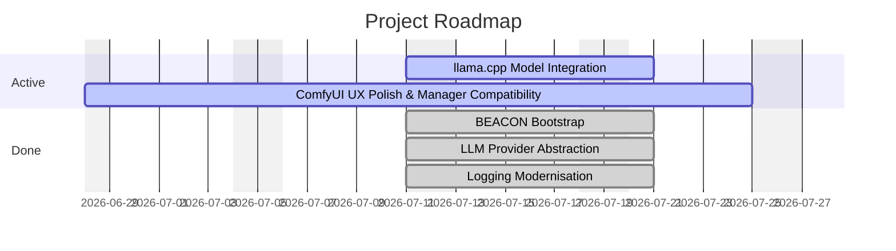

# comfydv — Roadmap

<!-- generated by beacon roadmap export — 2026-07-11 -->

> comfydv is a small, high-quality ComfyUI utility pack that fills the gaps the core node library leaves: composable string formatting, seed-controlled randomisation, and workflow flow-control. Winning looks like: every node is well-tested, installs in one step, produces no surprises in production workflows, and is documented well enough that a non-programmer ComfyUI user can connect it without reading source code.

## Timeline

## Epics

| Epic | Title | Status | Specs | Fidelity |
|---|---|---|---|---|
| [llamacpp-integration](project-management/Roadmap/epics/llamacpp-integration.md) | llama.cpp Model Integration | Active | — | S? A+ T:- |
| [ux-and-install](project-management/Roadmap/epics/ux-and-install.md) | ComfyUI UX Polish & Manager Compatibility | Active | 1/4 shipped | S+ A+ T:100% |
| [beacon-bootstrap](project-management/Roadmap/epics/archive/beacon-bootstrap.md) | BEACON Bootstrap | Done | — | S? A? T:- |
| [llm-provider-abstraction](project-management/Roadmap/epics/archive/llm-provider-abstraction.md) | LLM Provider Abstraction | Done | 1/1 shipped | S+ A+ T:58% |
| [logging-modernisation](project-management/Roadmap/epics/archive/logging-modernisation.md) | Logging Modernisation | Done | 1/1 shipped | S+ A+ T:100% |

_Fidelity: `S+/S?` = has specs / none · `A+/A?` = has ADRs / none · `T:N%` = task completion_

## Active Work

_No active bullets._

## Architectural Decisions

| ADR | Title | Status |
|---|---|---|
| [ADR-001](../../../ADRs/ADR-001-stdlib-logging-over-console-libraries.md) | Use stdlib logging instead of colored console output libraries | Accepted |
| [ADR-002](../../../ADRs/ADR-002-nullhandler-pattern-for-library-loggers.md) | NullHandler pattern for the comfydv package root logger | Accepted |
| [ADR-003](../../ADRs/ADR-003-requirements-txt-authoring-policy.md) | Hand-authored requirements.txt as a curated subset of pyproject.toml | Accepted |
| [ADR-004](project-management/ADRs/ADR-004-aiohttp-over-httpx-for-ollama.md) | Use aiohttp for Ollama HTTP communication instead of httpx | Accepted |
| [ADR-005](project-management/ADRs/ADR-005-ollama-host-config-via-client-node.md) | Ollama host configuration via OllamaClient node and OLLAMA_CLIENT socket type | Accepted |
| [ADR-007](project-management/ADRs/ADR-007-llm-provider-adapter-pattern.md) | LLMProvider adapter pattern shared across Ollama and llama.cpp | Accepted |
