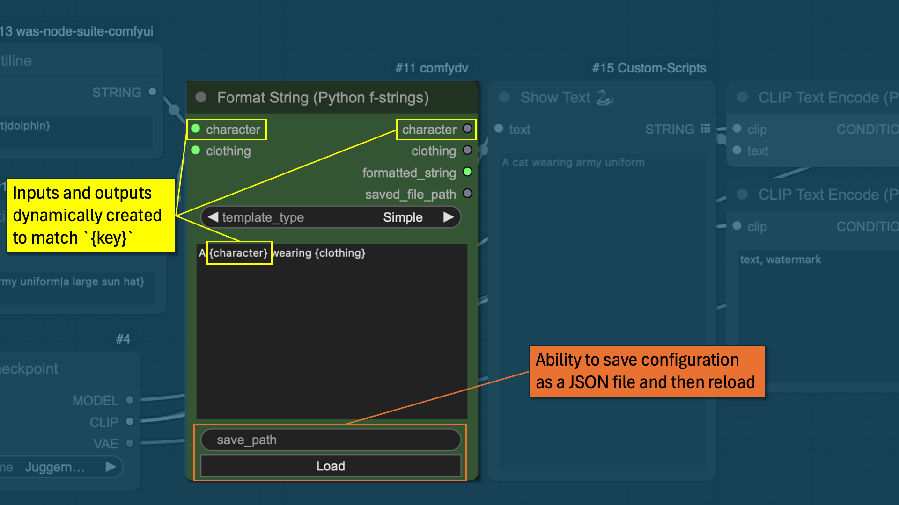
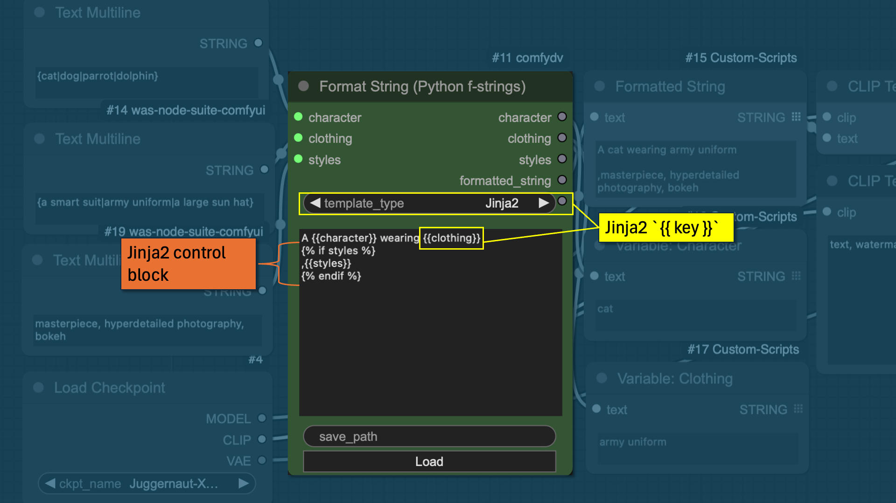
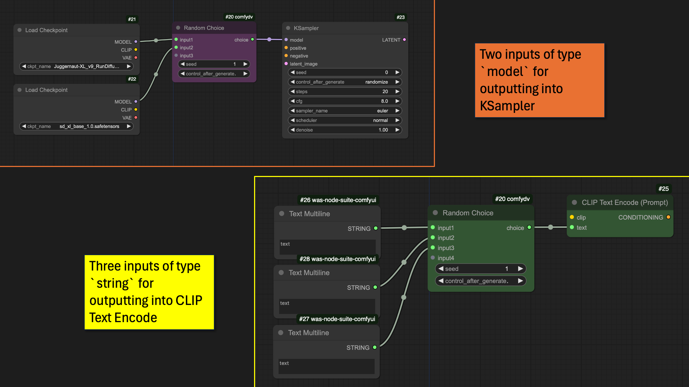

# comfydv

A collection of workflow efficiency and quality of life nodes that I've created for personal use out of necessity.

* **String Formatting**: Use either plain python f-strings or more advanced Jinja2 templating to format outputs.
* **Random Choice**: Add an abitrary number of inputs and then, with seed control, randomly select one for an output.

## String Formatting

### Python F-String

A simple python f-string dynamically creates the necessary inputs/outputs for the detected keys.

### Jinja 2

Switching to Jinja2 allows you to use more advanced control blocks and other filters/features of that templating language. See [Jinja documentation](https://jinja.palletsprojects.com/en/latest/) for further details.

## Random Choice

Ability to take arbitrary length and type of inputs to then output a **choice** with a controllable seed.

