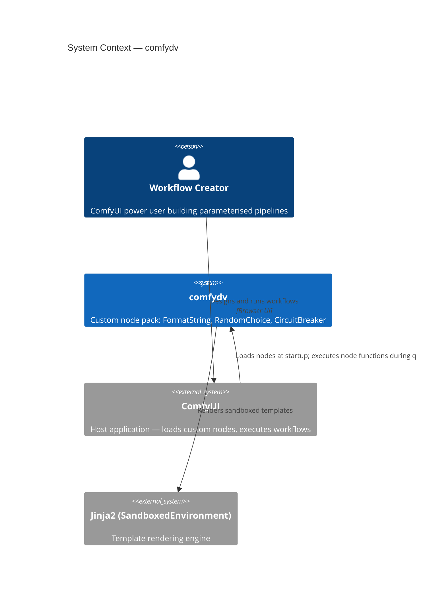
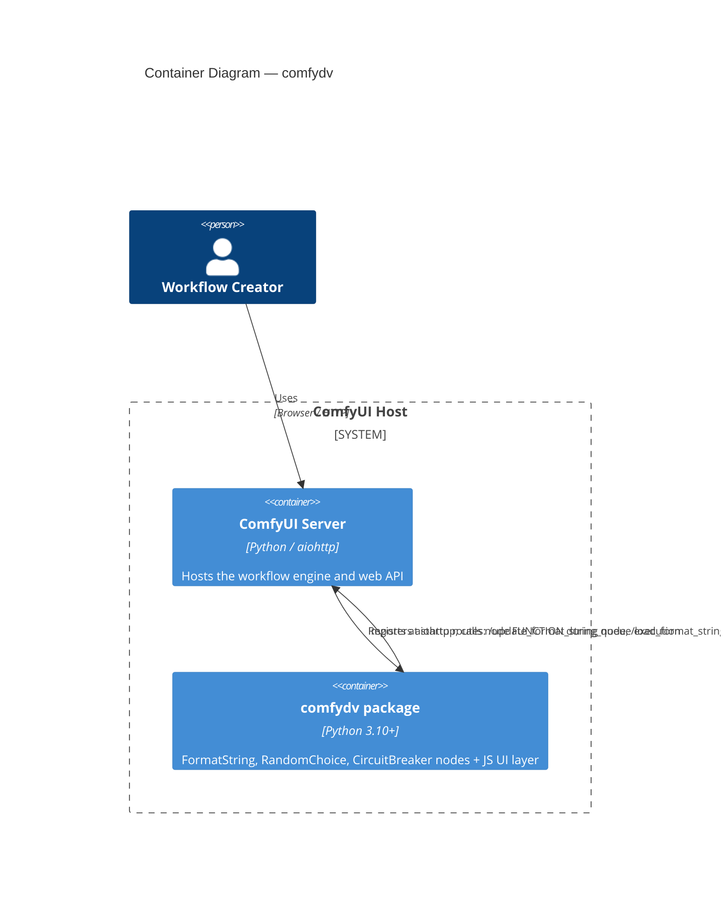
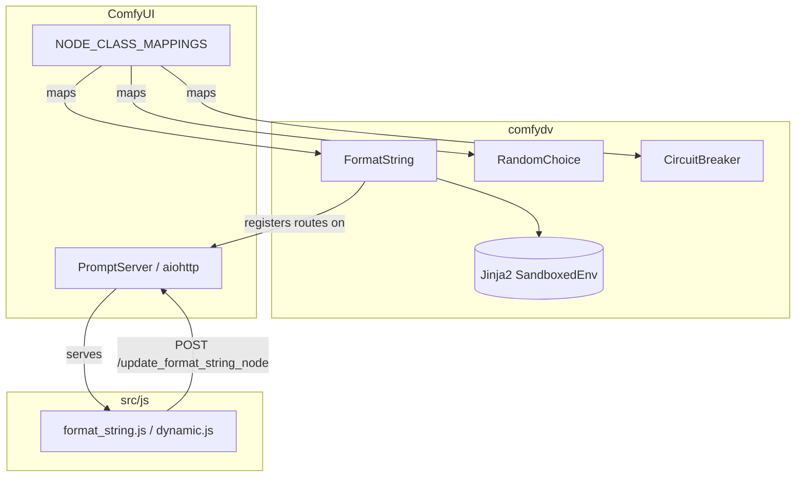
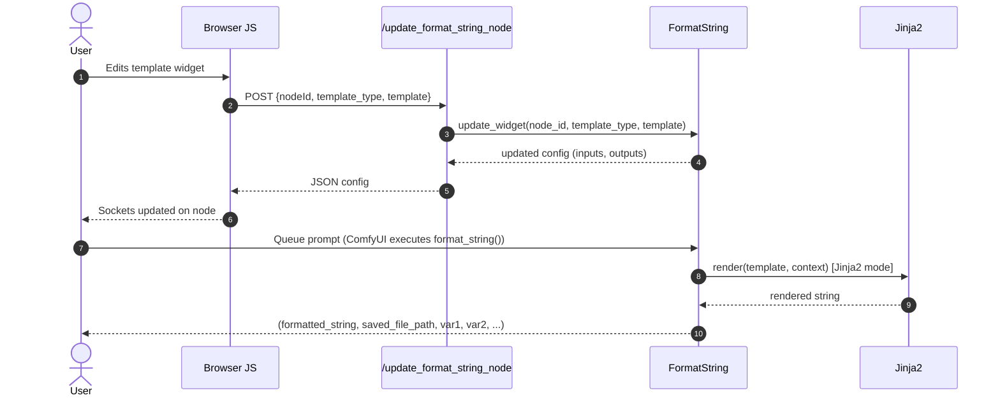

# Architecture Document

<!--
BEACON DESIGN phase deliverable. Update when a new ADR affects the architecture.
Always link to the relevant ADR rather than duplicating rationale here.
Use /design:diagram <component> to generate or regenerate any diagram below.
-->

## Overview

`comfydv` is a ComfyUI custom-node package. It is loaded by ComfyUI at startup from the `custom_nodes/` directory. The package exposes three nodes via `NODE_CLASS_MAPPINGS` and a JavaScript web directory via `WEB_DIRECTORY`. All node logic is pure Python; the JS layer handles dynamic UI updates (adding/removing input sockets when a template changes).

---

## C4 Context: System in its Environment

---

## C4 Container: Deployable Units

---

## System Components (logical view)

---

## Technology Stack

| Layer | Technology | Rationale | ADR |
|-------|-----------|-----------|-----|
| Language | Python 3.10+ | ComfyUI minimum | — |
| Package manager | uv | Speed, lockfiles | — |
| Linter/formatter | Ruff | Single tool, replaces flake8+black+isort | — |
| Type checking | ty | Astral native, replaces mypy | — |
| Template engine | Jinja2 (SandboxedEnvironment) | Sandboxed evaluation of user templates | — |
| Web framework | aiohttp (via ComfyUI's PromptServer) | ComfyUI's built-in; no additional server needed | — |
| Testing | pytest + pytest-cov | Standard Python; mocks out ComfyUI imports | — |
| Docs | mkdocs-material + mkdocstrings | Generates API docs from docstrings | — |

---

## Data Flow: FormatString (primary path)

---

## Output Order Contract (immutable)

FormatString outputs **must** be returned in this order — changing it breaks existing workflow connections silently:

| Index | Name | Type | Notes |
|-------|------|------|-------|
| 0 | `formatted_string` | STRING | Primary output |
| 1 | `saved_file_path` | STRING | Empty string if `save_path` not set |
| 2+ | `<variable_name>` | STRING | One per detected template variable, in order of first appearance |

---

## Non-Functional Requirements

- **Performance:** Template rendering is synchronous and CPU-bound; typical templates render in <1 ms. No caching layer needed at this scale.
- **Security:** Jinja2 `SandboxedEnvironment` prevents filesystem/subprocess access from user templates. `additional_context` is the only way to expose utilities.
- **Testability:** All node core logic (`_extract_keys`, `format_string`, `update_widget`) must be callable from pytest without a ComfyUI process. ComfyUI-specific imports are guarded by `if "comfy" in sys.modules`.
- **Observability:** `logging.getLogger(__name__)` at DEBUG level inside nodes; `rich.print` for user-visible output in the ComfyUI console.

---

## Tracer Bullet Decomposition

| Phase | Bullets | Outcome |
|-------|---------|---------|
| Bootstrap | 1 | BEACON artefacts populated; quality gates clean |
| Test hardening | 2 | Full unit coverage for all three nodes |
| Documentation | 3 | mkdocs site reflects current API |
| Distribution | 4+ | ComfyUI Manager listing; PyPI release |

---

_Created:_ 2026-06-28  
_Last updated:_ 2026-06-28 — initial DESIGN artefact  
_Status:_ Living document — update when ADRs change the architecture
